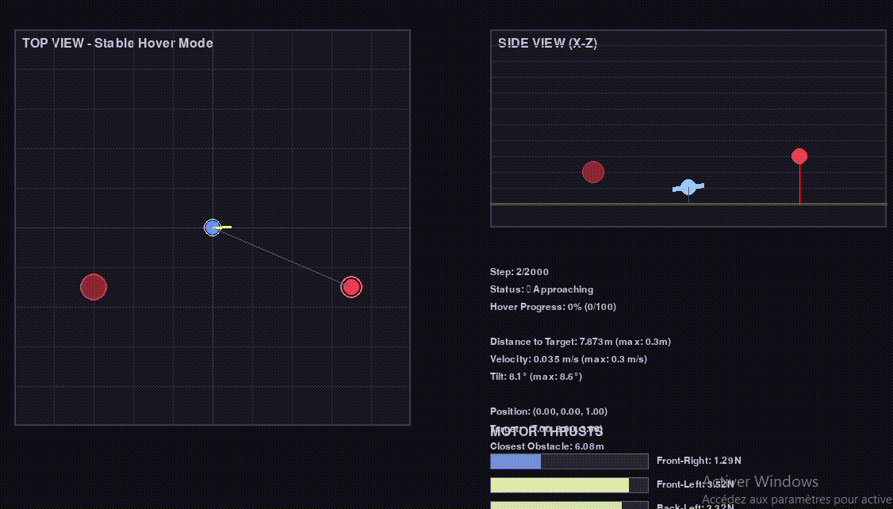
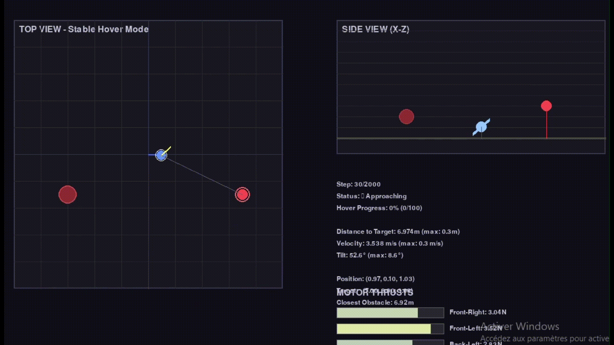

# Project Demos

This folder contains demonstration videos of our project, showcasing the reinforcement learning algorithms and paper visualizations for quadrotor control.

## Demo Videos

### 1. RL Hovering with Obstacle Avoidance

Demonstration of the RL-based quadrotor hovering while avoiding obstacles.

**File:** [RL_Hovering_obstacle.mp4](RL_Hovering_obstacle.mp4)

---

### 2. RL Perfect Landing with Obstacle Avoidance

Demonstration of the RL-based quadrotor performing a perfect landing while navigating around obstacles.

**File:** [RL_Perfect_Landing_obstacle.mp4](RL_Perfect_Landing_obstacle.mp4)

---

### 3. RL Hovering without Obstacles

Demonstration of the RL-based quadrotor hovering in an obstacle-free environment.

**File:** [RL_Hovering_no_obstacle.gif](RL_Hovering_no_obstacle.gif)

---

### 4. MPC Drone Simulation

Model Predictive Control (MPC) simulation of quadrotor flight dynamics.

**File:** [MPC_gif_drone.gif](MPC_gif_drone.gif)

---

### 5. Speed Control Demo (Paper Visualization)

Paper visualization demonstration showing the robot's speed control capabilities.

<video src="../Paper_Visualization/demo_speed.mp4" width="640" controls></video>

**File:** [demo_speed.mp4](../Paper_Visualization/demo_speed.mp4)

---

### 6. Webots Simulation Demo
*(Coming soon - video not yet uploaded)*

Demonstration of the robot simulation in Webots environment.

**File:** TBD
